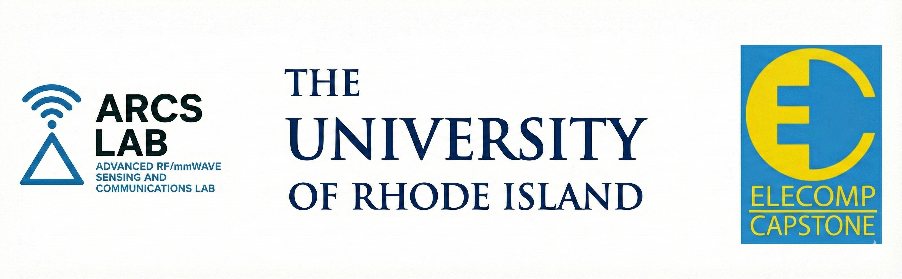

# OFDM Sense

## About

OFDM-Sense is the project lead by Dr. Guoyi Xu for the 25/26 URI ELECOMP Capstone Year.  The goal of this project is to develop an Orthogonal Frequency-Division Multiplexing (OFDM) Trasciever to run on an SDR Platofrm to explore the join commminicaiton and sensing (JCAS) capabilities of OFDM.